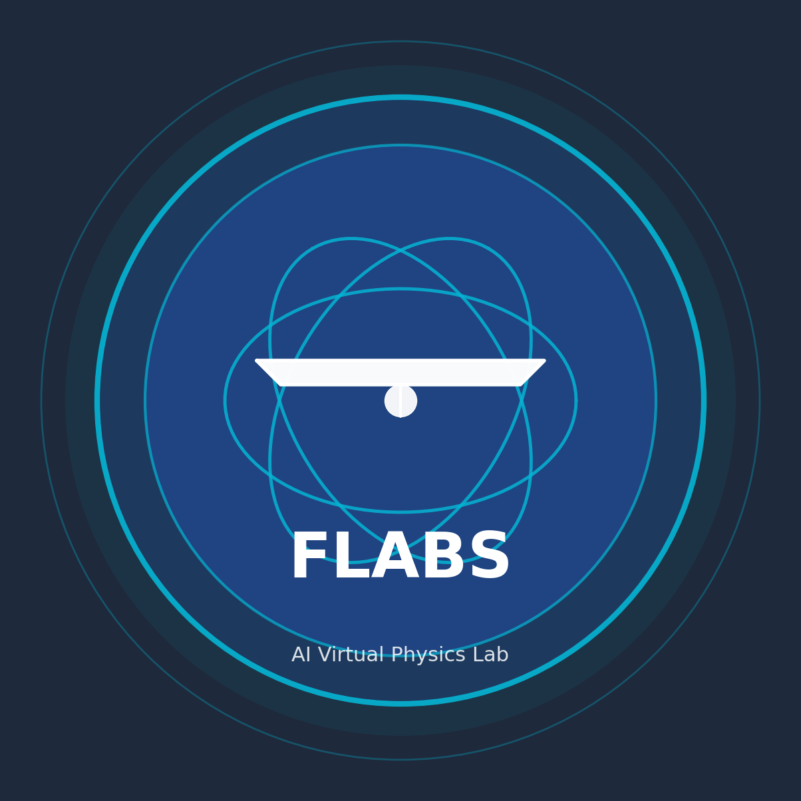

<p align="center">
  
</p>

<h1 align="center">flabs — AI Physics Playground</h1>

<p align="center">
  <b>Interactive physics experiments in your browser. A sandboxed AI agent builds your own labs. Your API key is used runtime-only — never stored.</b>
</p>

<p align="center">
  <a href="https://github.com/endgegnerbert-tech/lab-resurrector/blob/main/LICENSE"></a>
  <a href="https://nodejs.org/"></a>
  <a href="https://github.com/endgegnerbert-tech/lab-resurrector"></a>
  <a href="https://lab-resurrector.onrender.com"></a>
  <a href="https://dsh-hacks-v1.devpost.com"></a>
</p>

<p align="center">
  <a href="#try-it-now">Try It Now</a> •
  <a href="#how-it-works">How It Works</a> •
  <a href="#features">Features</a> •
  <a href="#security">Security</a> •
  <a href="#tech-stack">Tech Stack</a> •
  <a href="#supported-providers">Supported Providers</a> •
  <a href="#quick-start">Quick Start</a>
</p>

---

## Try It Now

**https://lab-resurrector.onrender.com**

Open in any browser. Every visitor gets a temporary private lab space automatically. Two public experiments are included (Water Rocket, Wave Interference), and the AI assistant can build private labs for you. Your API key is sent to the server **only for one agent turn** and is never persisted.

*No install. Bring your own provider key.*

---

## The Problem

9 out of 10 schools in developing countries have no physics lab. Real labs cost over $5,000. Existing digital solutions are passive — they show what happens but don't explain why.

**85% of students have a smartphone. What if the phone was the lab?**

## The Solution

flabs turns any browser into an interactive physics lab with an AI assistant that builds simulations for you. The agent runs in a server-side sandbox with restricted tools — it can only read/write four lab files. Your provider key is used **runtime-only** for a single turn and is never written to disk.

| Others | flabs |
|--------|-------|
| Simulation plays, student watches | AI asks, student hypothesizes, together they test |
| API keys stored on server | Key is runtime-only, discarded after one turn |
| Locked to one AI provider | 18+ providers, you choose |
| Pre-built labs only | Each browser gets a private lab space and can build by chat |

---

## How It Works

```
                          YOUR BROWSER
  ┌─────────────────────────────────────────────────────────┐
  │  Launchpad + Lab View (index.html, js/main.js)          │
  │  - Keys live in page memory only                        │
  │  - Provider/model optionally remembered in localStorage │
  │       │                                                 │
  │       │ POST /api/agent/chat (key + message, one turn)  │
  │       ▼                                                 │
  └──────────────────────┬──────────────────────────────────┘
                         │ same-origin HTTPS
                         ▼
                     SERVER (Node + Express + pi SDK)
  ┌─────────────────────────────────────────────────────────┐
  │  /api/agent/chat  →  pi SDK createAgentSession()        │
  │  - Key is a runtime-only AuthStorage override           │
  │  - Agent sandbox: space_read_file / space_write_file    │
  │                   space_list_files (4 files only)       │
  │  - No shell, no network, no external CDN scripts        │
  │  - Session is per-turn, key discarded afterwards        │
  │                  │                                      │
  │                  │ provider call (your key, one turn)   │
  │                  ▼                                      │
  │            LLM API (OpenAI, Anthropic, DeepSeek...)     │
  └─────────────────────────────────────────────────────────┘
                         │
                         ▼  generated lab files written
  SANDBOXED IFRAME (sandbox="allow-scripts", null origin)
  ┌─────────────────────────────────────────────────────────┐
  │  Canvas 2D / p5 / matter.js simulation                  │
  │  Talks to parent only via postMessage (params, data)    │
  └─────────────────────────────────────────────────────────┘
```

**Key property: the agent runs server-side but in a tight sandbox.** It can edit only the four lab files of your private space and has no shell or network access. Your API key is used for one agent turn and is never persisted to disk. Lab simulations render in a sandboxed iframe (null origin) so generated code cannot reach the parent app.

---

## Features

### Water Rocket Lab
Realistic 2-bottle water rocket simulation with real physics:
- **Parameters:** Pressure (1-6 bar), water fill ratio (10-80%), launch angle (10-80 deg)
- **Live data:** Flight time, max height, range, velocity
- **Physics:** Thrust from pressure differential, Tsiolkovsky rocket equation, projectile motion

### Wave Interference Lab
Two coherent point sources with visible superposition:
- **Parameters:** Wavelength, source distance, phase shift, amplitude
- **Live data:** Max deflection, relative intensity, node count
- **Physics:** Superposition principle, constructive/destructive interference

### Lab Space System
- Isolated iframes — each experiment is its own sandboxed HTML page (`sandbox="allow-scripts"`, null origin)
- postMessage bridge — main app controls params, play/reset, data panel; messages are bound to the owned frame via `event.source`
- Formula panel — shows the math behind the experiment
- Data panel — live measurements with CSV/JSON export
- AI chat — natural language interaction with the lab assistant

---

## AI Tools

The server-side pi SDK agent exposes only these restricted tools to the LLM:

| Tool | What It Does |
|------|-------------|
| `space_read_file` | Read one of the four allowed lab files |
| `space_write_file` | Write one of the four allowed lab files (validated) |
| `space_list_files` | List the allowed file names |

The agent **cannot** run shell commands, access the network, read files outside the space, load external CDN scripts, or store/exfiltrate API keys. Provider/model lists come from the pi SDK `ModelRegistry`.

---

## Security

**Runtime-only key, sandboxed agent.** Your provider key is sent over same-origin HTTPS for a single agent turn and used as a runtime-only `AuthStorage` override — it is never written to disk.

- The server-side pi SDK agent runs with only `space_read_file` / `space_write_file` / `space_list_files`
- API keys live in page memory only; provider/model optionally in `localStorage`
- Lab code runs in a sandboxed iframe (null origin) so it cannot reach the parent app or your `sessionStorage`
- The repo root is never served — only allow-listed assets (`/css`, `/js`, `index.html`, logo, `SECURITY.md`)
- New visitors get a temporary private session automatically with an `HttpOnly`, `SameSite=Strict`, browser-session cookie
- Full security model documented in [`SECURITY.md`](SECURITY.md)

---

## Tech Stack

| Category | Technology |
|----------|-----------|
| Backend | Node.js, Express |
| Agent runtime | `@earendil-works/pi-coding-agent` (server-side pi SDK) |
| Frontend | HTML5, CSS3, Canvas 2D API, p5.js, matter.js |
| AI Providers | 18+ (OpenAI, Anthropic, DeepSeek, Groq, Google, Together...) |
| Storage | page memory for keys, localStorage for provider/model prefs, JSON files for temporary labs |
| Deploy | Render Free demo, paid Render + disk for persistence |
| Formats | JSON, CSV |

Zero external frontend framework dependencies. No React, no Vue, no jQuery.

---

## Supported Providers

| Provider | Format | Models |
|----------|--------|-------|
| OpenAI | OpenAI | GPT-4o, GPT-4o mini, o3, o4-mini |
| Anthropic | Anthropic | Claude Sonnet 4, Haiku 3.5, Opus 4 |
| DeepSeek | OpenAI | V4 Flash ($0.14/$0.28 per 1M tok), V4 Pro |
| Groq | OpenAI | Llama, Mixtral (free tier available) |
| Google | Google | Gemini 2.0 Flash, Pro |
| Together AI | OpenAI | Open-source models |
| Fireworks AI | OpenAI | Fast inference |
| OpenRouter | OpenAI | Meta-provider, 200+ models |
| Mistral | OpenAI | Mistral Large, Small |
| Hugging Face | OpenAI | Community models |
| NVIDIA | OpenAI | NIM inference |
| xAI | OpenAI | Grok |
| Cerebras | OpenAI | Fast, cheap inference |
| Moonshot AI | OpenAI | Kimi models |
| Minimax | OpenAI | MiniMax models |
| Ant-Ling | OpenAI | Code-specialized |

Full provider/model catalog at [`sources/pi-model-catalog.json`](sources/pi-model-catalog.json).

### AI Model Economics

| Model | Input / 1M tok | Output / 1M tok | Best For |
|-------|---------------|----------------|----------|
| DeepSeek V4 Flash | $0.14 | $0.28 | Budget agent tasks |
| Gemini 2.0 Flash | $0.10 | $0.40 | Large context (1M tokens) |
| GPT-4o mini | $0.15 | $0.60 | Balanced quality/price |
| Claude Haiku 3.5 | $1.00 | $5.00 | Reliability |
| DeepSeek V4 Pro | $0.32 | $0.64 | Higher quality reasoning |

*Developed and tested with DeepSeek V4 Flash — the cheapest model with reliable tool calling.* Every user can choose their own price/quality balance.

*Developed and tested with DeepSeek V4 Flash — the cheapest model with reliable tool calling.* Every user can choose their own price/quality balance.

---

## Project Structure

```
flabs/
├── server.js                  # Express + REST API + server-side pi SDK agent
├── index.html                 # Main app (Launchpad + Space View)
├── flabs_logo.png             # Project logo
├── SECURITY.md                # Security model documentation
├── render.yaml                # Render deploy configuration
├── css/
│   └── style.css              # Dark-theme responsive UI
├── js/
│   ├── main.js                # App entry, view switching, lab/sandbox management
│   ├── ai/agent.js            # Thin browser bridge to /api/agent/chat
│   └── experiment/api.js      # Measurement API (live data, CSV/JSON export)
├── experiments/
│   ├── manifest.json          # Space registry
│   └── spaces/
│       ├── rocket/            # Water Rocket lab
│       └── wellen/            # Wave Interference lab
└── sources/
    ├── pi-model-catalog.json  # Full provider/model catalog
    └── formulas/              # Physics formula library
```

---

## Quick Start

### Prerequisites
- Node.js 18+

### Run

```bash
npm install
npm start
# -> http://localhost:3210
```

### Enter Your API Key
The provider dialog opens automatically. Choose a provider/model and paste your API key. It is sent to the server **only for one agent turn** (over same-origin HTTPS) and never persisted. Supported: OpenAI, Anthropic, DeepSeek, Groq, Google, 13+ more.

*Without an API key:* All physics experiments, controls, data panels, and measurements work. Only the AI builder requires a key.

### Deploy to Render

Render Free is good for the live hackathon demo, but its filesystem is temporary. Private sessions and labs can disappear after spin-down, restart, or redeploy.

For Free deploys, keep `FLABS_DATA_PERSISTENT=false` so the app shows the warning. For real persistence, use a paid Render web service with a persistent disk mounted at `FLABS_DATA_DIR` and set `FLABS_DATA_PERSISTENT=true`.

```bash
git push origin main
# Go to https://dashboard.render.com
# New -> Web Service -> Connect GitHub repo
# Render auto-detects render.yaml
```

---

## Project Status

Built for **[DSH Hacks V1](https://dsh-hacks-v1.devpost.com)** — AI x STEM Education hackathon.

**What works:**
- Two complete physics experiments (Water Rocket, Wave Interference)
- Server-side pi SDK agent that builds your own labs via chat (18+ providers)
- Sandboxed lab iframes (null origin) for generated code isolation
- Live measurement streaming, data panel, CSV export
- Temporary private browser sessions, no signup or login
- Runtime-only key handling (never persisted)

**Roadmap / Future Work:**
- More experiments (pendulum, optics, electricity)
- Self-hosted deployment option with process isolation (dedicated server, reverse proxy, HTTPS) for full persistence beyond the free-tier demo
- Community-contributed experiment spaces

---

## Links

- **Live Demo:** https://lab-resurrector.onrender.com
- **GitHub:** https://github.com/endgegnerbert-tech/lab-resurrector
- **Devpost:** https://dsh-hacks-v1.devpost.com
- **Security:** [SECURITY.md](SECURITY.md)

---

## License

MIT
